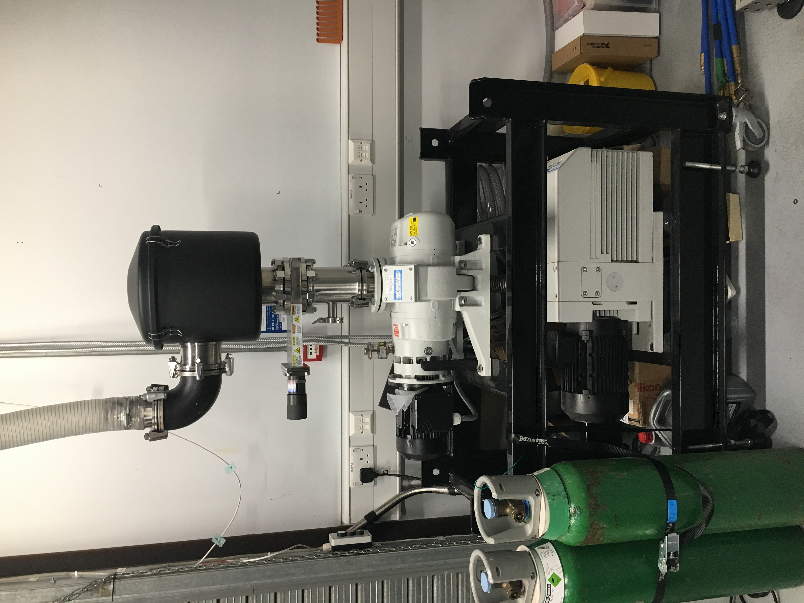

.. Xraydocs documentation master file, created by
   sphinx-quickstart on Mon Apr  8 07:40:49 2019.
   You can adapt this file completely to your liking, but it should at least
   contain the root `toctree` directive.

Vacuum pump system
==================
There are several pumps used to draw a vacuum on the various gas gun platforms in the lab. These pumps are connected to an expansion vessel and a given target chamber through a network of fixed, 100 mm diameter piping overhead.

Primary pump system
-------------------

   Primary vacuum pump system.

The primary vacuum system is a Lleybold Ruvac WA 251 backed by a Leybold D65.

The pumps are turned on independently from their respective 3-phase switches (show images). It is very important to remember that the Roots pump cannot be switched on unless a sufficient vacuum (absolutely no greater than 10 Torr) is achieved! Turning the Roots on at higher pressure levels will damage it and reduce its overall life.

Sabot vacuum system
-------------------
(add image of sabot vacuum)

For each of the gun systems in the lab, a vacuum is applied to the rear of the sabot to prevent it from slipping forward prior to the experiment. This vacuum is applied using a (make/model) pump system.

The pump is turned on by a power switch located on the rear of the pump (show image).

Operation
---------
Assuming the sabot is loaded and the gun closed-up and prepared for drawing a vacuum:
 - Ensure the vacuum line is connected to the relevant target tank.
 - Close the hand valve before the primary pump system.
 - Verify all LabVIEW controlled valves (main and sabot valves) are closed.
 - Switch on the sabot vacuum pump.
 - When the sabot vacuum reaches <50 mtorr, turn on the Ruvac pump.
 - When the target tank vacuum reaches < 10 Torr, turn on the Roots pump.