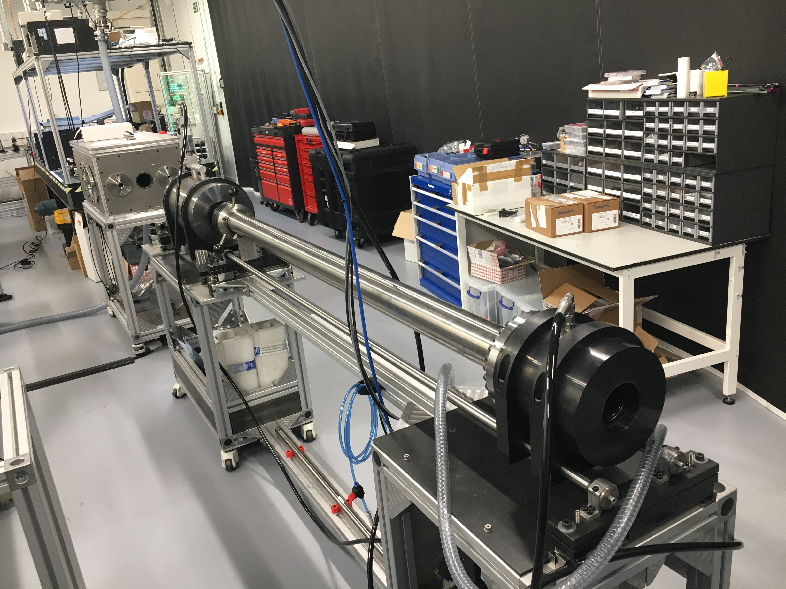

Two-stage gas gun
=================

   2-stage light gas gun system
   
Specifications
--------------

 - 50 mm pump-tube / 10 mm launch tube
 - 4.7 km/s peak velocity (1g sabot)
 - Can be operated in single-stage or 2-stage mode

Operation
---------

LabVIEW control system
......................