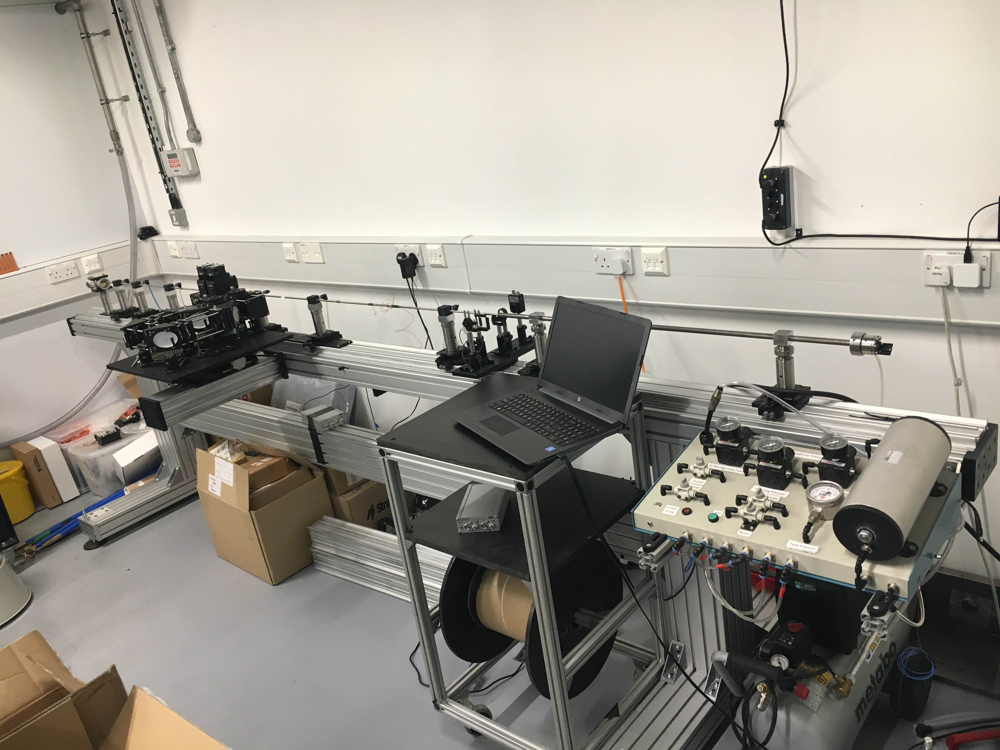

mini Split Hopkinson Pressure Bar
=================================

   mini-SHPB system
   
Specifications
--------------

 - air-bearing bar supports
 - 6 mm bars
 - axial PDV for input bar velocity

Configurations
..............

Operation
---------